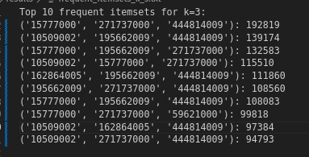
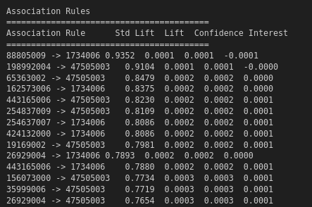
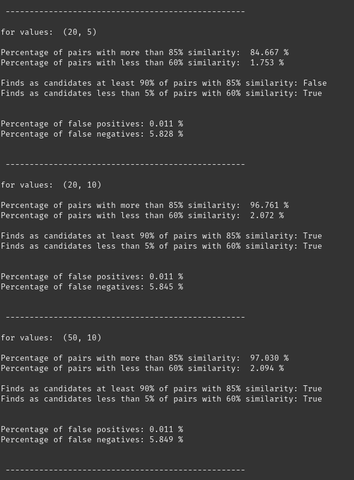
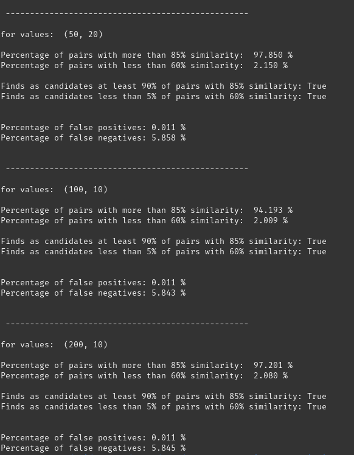
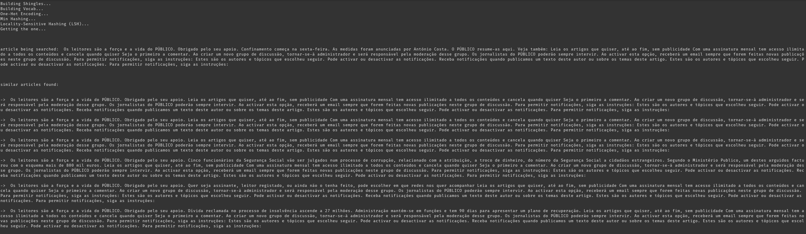

# MDLE_Frequent_items_association_rules


## Ex 1: Market basket analysis 

### How to run (exercises 1.1, 1.2, 1.3) 

```bash
spark-submit frequent_items.py conditions.csv results
```

The results will be stored in the results folder. 

### Results




## Ex2: LSH

### How to Run 
- 2.1, 2.3: 
```bash
$python3 lsh_get_sim.py -b 20 -r 10
```

- 2.2: 
```bash
$python3 run_lsh.py -b 20 -r 10
```

### Results

- ex 2.1 / 2.3 




- ex 2.2 



 